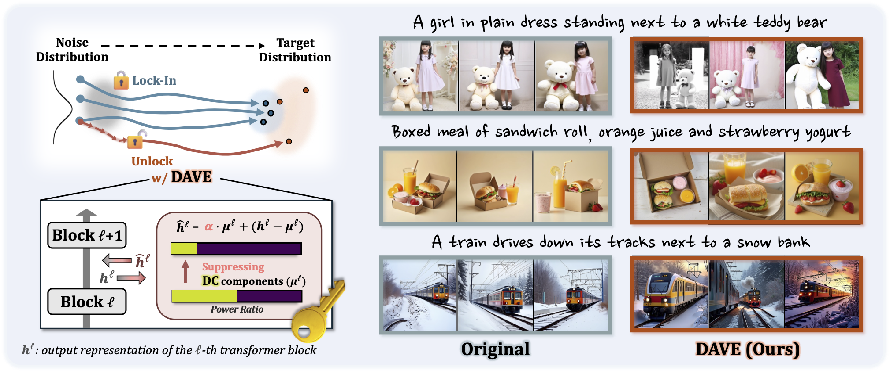

# DAVE 🔓

This is the official PyTorch implementation of **Breaking the Lock-in: Diversifying Text-to-Image Generation via Representation Modulation**, published at **ICML 2026**.

**Dahee Kwon · Haeun Lee · Jaesik Choi**

[](https://arxiv.org/abs/2606.06813)
[](https://icml.cc/)

## 📖 Abstract
Recent text-to-image models produce high-quality, prompt-aligned images, but samples generated from the same prompt often look overly similar. We investigate this homogeneity by analyzing intermediate Transformer features and find that their spatial average, or DC component, quickly becomes similar across different seeds early in generation. This early convergence locks generation trajectories into similar outcomes and reduces later variation. Motivated by this, we propose DC Attenuation for diVersity Enhancement (**DAVE**), a training-free representation-level intervention that attenuates the early DC component. DAVE improves prompt-consistent diversity with negligible overhead while maintaining image quality.



---

## ⚙️ Setup

Follow the steps below to prepare the environment and install DAVE.

### 1. Environment Configuration
Create and activate the required Conda environment:

```
conda env create -f environment.yaml
conda activate DAVE
```
### 2. Install Diffusers
To use our source code, clone the diffusers repository to your local workspace:

```
git clone https://github.com/huggingface/diffusers.git
```

### 3. Apply DAVE Modifications
Overwrite the standard diffusers source files with the customized DAVE files, and then install the package from source:

```
# Copy custom DAVE scripts into the diffusers directory
cp diffusers_dave/pipeline_stable_diffusion_3.py diffusers/src/diffusers/pipelines/stable_diffusion_3/pipeline_stable_diffusion_3.py
cp diffusers_dave/transformer_sd3.py diffusers/src/diffusers/models/transformers/transformer_sd3.py

# Install from source
cd diffusers
pip install -e .
```  

### 4. Extending to Other Models (Optional)
If you want to apply this method to models beyond Stable Diffusion 3, simply adapt the code sections marked below into your target model's codebase.
 
```
  # ========================= DAVE CHANGE START =========================
    ...
  # ========================== DAVE CHANGE END ==========================
```  
💡 Note: We will be releasing custom-dave versions for other models shortly!


## 🚀 Usage
Now you are ready to play with DAVE!  
You can interactively explore our method using the provided Jupyter notebook:
- 📓 **[`DAVE-demo.ipynb`](./DAVE-demo.ipynb)**


## 📝 Citation
If you find this repo useful, please cite our paper:

```
@misc{kwon2026breakinglockindiversifyingtexttoimage,
      title={Breaking the Lock-in: Diversifying Text-to-Image Generation via Representation Modulation}, 
      author={Dahee Kwon and Haeun Lee and Jaesik Choi},
      year={2026},
      eprint={2606.06813},
      archivePrefix={arXiv},
      primaryClass={cs.CV},
      url={https://arxiv.org/abs/2606.06813}, 
}
```

## 📬 Contact
For questions, research discussions, or collaboration opportunities, please feel free to contact [Dahee Kwon](mailto:dahee.kwon@kaist.ac.kr)
